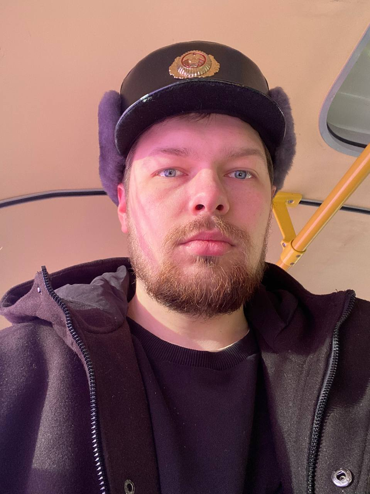

# Михаил Драбинович                                                   



Беларусь, город Гродно  
230017  


#### Contacts
+ Телефон: +375 (25) 978-03-46  
+ Почта: _hotabych39@gmail.com_  
+ Telegram: @vesta228322  
+ Discord: VESTA228322


## Profile

Я начинающий разработчик. Знаю основы __JavaScript__, __React__. Очень сильно хочу стать фулстек разработчиком, или хотябы фронтенд.  
О своих сильных сторонах не знаю что написать, не хочу показаться унылым, но если мне дать какую-нибудь задачу, то я постараюсь её выполнить хорошо. Опыта работы как такового нету, но благодаря _RS School_ думаю появится.  
Желание учиться - огромное, очень хочу поработать в команде, т.к. никогда такого опыта не было.  


## Skills

* JavaScript
* React
* Git
* VS Code  


## Code Example

Решение из [Codewars](https://www.codewars.com/kata/5412509bd436bd33920011bc)
```
function maskify(cc) {
  if (cc.length <= 4)  return cc;

  let mask = '#'.repeat(cc.length - 4);

  let str = cc.slice(-4);

  return mask + str;
}
```


## Experience

Из опыта работы могу выделить только учебный проект (как по мне, это такой себе опыт где меня как говорится вели за ручку) вот ссылка на [проект](https://github.com/vesta228322/learn-react-project-marvel)


## Education

Образование у меня средлнее специальное :)  
Учился программированию я сам, никакие курсы не проходил


## Language

Не знаю где проверить свой уровень владения английского языка, практики не было.  
Знаю только по школьной программе
